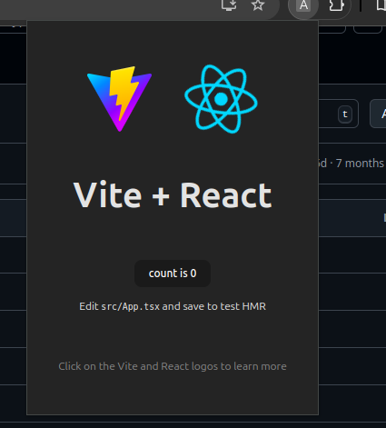

# React + TypeScript + Vite

## Getting Started

```bash
npm install 
npm build 
```

### Adding build extension to chrome

You will see a new directory created called build/ which contains the necessary files to create a chrome extension app. Once the build succeeds, head over to chrome://extensions/ , enable ‘Developer mode’ and ‘Load unpacked’ by selecting the build directory that was just created!


